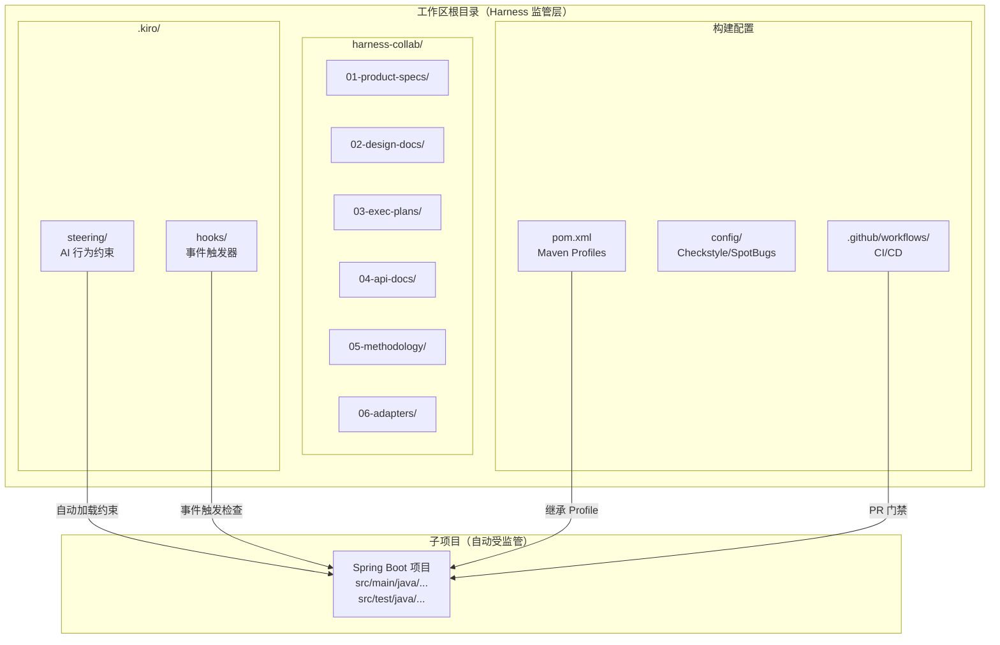
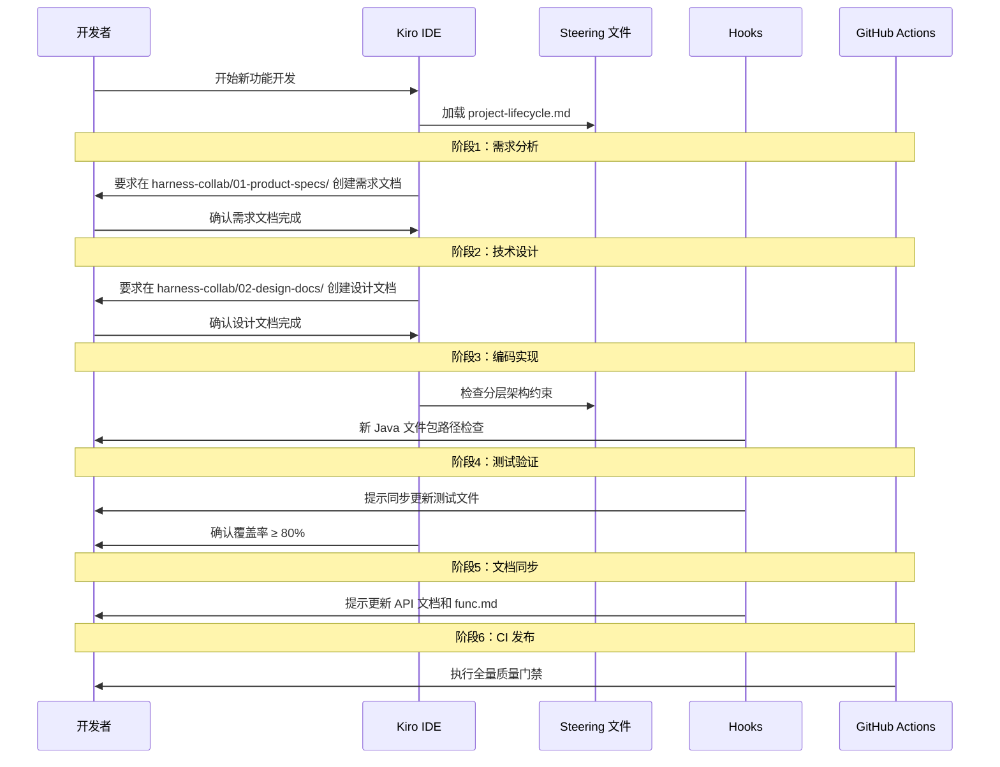

# 技术设计文档：Spring Boot Harness 工程管理模板

## 概述

Spring Boot Harness 工程管理模板是一套部署在 Kiro 工作区根目录的"监管层"基础设施。其核心思想是**规范即代码、门禁即流程**：通过 Kiro 原生机制（steering 文件、hooks、spec 规范）将工程标准内嵌到 AI 辅助开发流程中，使 Kiro 在每次对话和每次代码生成时都自动遵循团队约定，无需开发者手动重复说明约束。

### 核心定位

```
Workspace_Root/
├── .kiro/                  ← Harness 监管层（本模板核心）
│   ├── steering/           ← AI 行为约束文件，自动加载
│   └── hooks/              ← 事件驱动自动化触发器
├── harness-collab/         ← AI 协作文档体系
├── config/                 ← 静态检查配置
├── pom.xml                 ← Maven 多 Profile 构建配置
├── .github/workflows/      ← CI/CD 配置
├── README.md               ← 模板使用文档
├── AGENTS.md               ← AI 协作协议入口
└── {sub-project}/          ← 开发者新建的 Spring Boot 子项目（自动受监管）
```

当开发者在 `Workspace_Root` 下创建任意 Spring Boot 子项目时，`.kiro/steering/` 中的所有 steering 文件自动对该子项目生效，Kiro 无需额外加载配置即可在整个 Dev_Lifecycle 六阶段中执行监管。

### 设计目标

| 目标 | 说明 |
|------|------|
| 零配置生效 | 新建子项目无需任何额外配置，Harness 自动监管 |
| 全生命周期覆盖 | 需求 → 设计 → 编码 → 测试 → 文档 → CI 六阶段均有门禁 |
| 双模式支持 | Bootstrap（新项目强制门禁）和 Retrofit（历史项目渐进接入）|
| 可验证性 | 每个门禁均可通过 `mvn` 命令或 Hook 触发验证 |

---

## 架构

### 整体架构图



### Dev_Lifecycle 六阶段监管架构



### Steering 文件加载机制

Kiro 在每次对话启动时自动扫描 `.kiro/steering/` 目录，加载所有 `inclusion: auto` 的 steering 文件。这意味着无论开发者在工作区的哪个子目录下工作，这些约束都始终生效。

```
.kiro/steering/
├── java-engineering-standards.md    # inclusion: auto — Java 工程规范
├── testing-quality-standards.md     # inclusion: auto — 测试与质量规范
├── api-doc-sync-protocol.md         # inclusion: auto — API 文档同步规范
├── ai-collaboration-protocol.md     # inclusion: auto — AI 协作协议
└── project-lifecycle.md             # inclusion: auto — Dev_Lifecycle 六阶段流程
```

---

## 组件与接口

### 组件一：Steering 文件体系

#### 1.1 `java-engineering-standards.md`

**职责**：约束 Kiro 生成的 Java 代码符合分层架构和编码标准。

**关键约束内容**：
- 四层架构强制约束：`controller → service → domain ← repository`
- 禁止跨层直接依赖（controller 不得直接调用 repository）
- 所有公共方法必须包含 Javadoc 注释
- 类命名、方法命名遵循 Google Java Style Guide
- 包结构约定：`{basePackage}.{layer}` 格式

**文件头部元数据**：
```yaml
---
inclusion: auto
---
```

#### 1.2 `testing-quality-standards.md`

**职责**：规定测试分层策略和测试命名规范。

**关键约束内容**：
- service 层：`@ExtendWith(MockitoExtension.class)` 单元测试
- controller 层：`@WebMvcTest` 切片测试
- repository 层：`@DataJpaTest` 或 `@MybatisTest` 切片测试
- 测试方法命名：`should_[预期行为]_when_[条件]`
- 测试类与被测类保持相同包路径
- 解析器/序列化器必须编写往返属性测试

#### 1.3 `api-doc-sync-protocol.md`

**职责**：规定 API 文档同步规则，防止文档与代码脱节。

**关键约束内容**：
- 新增公共 API 必须同步更新 `harness-collab/04-api-docs/`
- API 变更必须同步更新 `harness-collab/func.md`
- API 文档格式：OpenAPI 3.0 YAML 或标准 Markdown 模板

#### 1.4 `ai-collaboration-protocol.md`

**职责**：定义 Kiro 与开发者的协作协议，规范 AI 交付行为。

**关键约束内容**：
- Kiro 在生成代码前必须确认需求文档和设计文档已存在
- Kiro 不得跳过任何 Lifecycle_Gate 检查点
- Kiro 在每次交付后必须输出交付摘要（修改文件列表、测试状态、文档同步状态）

#### 1.5 `project-lifecycle.md`

**职责**：定义 Dev_Lifecycle 六阶段流程及每个阶段的准入/准出标准。

**六阶段定义**：

| 阶段 | 准入条件 | 准出标准 | 关联文档 |
|------|----------|----------|----------|
| 1. 需求分析 | 无 | `harness-collab/01-product-specs/` 下需求文档已创建并确认 | product-spec-template.md |
| 2. 技术设计 | 需求文档已确认 | `harness-collab/02-design-docs/` 下设计文档已创建并确认 | design-doc-template.md |
| 3. 编码实现 | 设计文档已确认 | 代码符合分层约束，测试类已同步创建 | java-engineering-standards.md |
| 4. 测试验证 | 测试类已创建 | 单元测试覆盖率 ≥ 80%，`harness-collab/03-exec-plans/` 已记录 | testing-quality-standards.md |
| 5. 文档同步 | 测试验证通过 | `harness-collab/04-api-docs/` 和 `func.md` 已更新 | api-doc-sync-protocol.md |
| 6. CI 发布 | 文档同步完成 | `mvn clean verify -Pharness-new` 全量通过 | ci-verify.yml |

---

### 组件二：Hooks 自动化体系

#### 2.1 API 文档同步检查 Hook

**文件**：`.kiro/hooks/api-doc-sync-check.md`

**触发条件**：`controller` 包下的 Java 文件被修改（`fileEdited` 事件，文件模式：`**/controller/**/*.java`）

**行为**：
```
触发后提示：
"检测到 Controller 层文件变更：{文件名}
请确认以下操作：
1. 是否有新增或修改的公共 API 端点？
2. 如有，请更新 harness-collab/04-api-docs/{对应文档}.md
3. 请同步更新 harness-collab/func.md 中的功能状态
操作指引：参考 harness-collab/05-methodology/dev-workflow.md 第5阶段"
```

#### 2.2 代码分层约束检查 Hook

**文件**：`.kiro/hooks/layer-constraint-check.md`

**触发条件**：新 Java 文件被创建（`fileCreated` 事件，文件模式：`**/*.java`）

**行为**：
```
触发后检查：
- 文件路径是否包含合法层级关键字（controller/service/domain/repository/config/common/exception）
- 如路径不符合约定，输出警告：
  "新建文件 {文件路径} 的包路径可能不符合分层架构约定。
  合法包层级：controller | service | domain | repository | config | common | exception
  请确认该文件的职责，并将其放置在正确的包层级中。
  参考：.kiro/steering/java-engineering-standards.md"
```

#### 2.3 测试覆盖提醒 Hook

**文件**：`.kiro/hooks/test-coverage-reminder.md`

**触发条件**：`service` 或 `domain` 包下的 Java 文件被修改（`fileEdited` 事件，文件模式：`**/service/**/*.java,**/domain/**/*.java`）

**行为**：
```
触发后提示：
"检测到业务代码变更：{文件名}
请确认以下操作：
1. 对应测试文件是否已同步更新？
   测试文件路径：src/test/java/{相同包路径}/{类名}Test.java
2. 新增方法是否已覆盖测试？
3. 当前覆盖率是否满足 ≥ 80% 要求？
   验证命令：mvn clean verify -Pharness-new
操作指引：参考 .kiro/steering/testing-quality-standards.md"
```

#### 2.4 Maven Profile 继承提醒 Hook

**文件**：`.kiro/hooks/maven-profile-check.md`

**触发条件**：`pom.xml` 文件被创建（`fileCreated` 事件，文件模式：`**/pom.xml`）

**行为**：
```
触发后提示：
"检测到新的 pom.xml 文件：{文件路径}
请确认是否已继承 Harness Maven Profile 配置：
- 新项目（Bootstrap_Mode）：使用 -Pharness-new（强制门禁，覆盖率 ≥ 80%）
- 历史项目（Retrofit_Mode）：使用 -Pharness-legacy（宽松门禁，仅警告）
配置参考：工作区根目录 pom.xml 中的 Profile 定义
操作指引：参考 harness-collab/06-adapters/ 下的接入指南"
```

---

### 组件三：harness-collab 文档体系

```
harness-collab/
├── README.md                          # 文档体系说明
├── AGENTS.md                          # AI 协作协议（完整版）
├── func.md                            # 功能资产总表
├── 01-product-specs/
│   ├── README.md
│   └── templates/
│       └── product-spec-template.md   # 需求文档模板
├── 02-design-docs/
│   ├── README.md
│   └── templates/
│       └── design-doc-template.md     # 技术设计文档模板
├── 03-exec-plans/
│   ├── README.md
│   └── templates/
│       └── exec-plan-template.md      # 执行计划模板
├── 04-api-docs/
│   ├── README.md
│   └── templates/
│       └── api-doc-template.md        # API 文档模板（OpenAPI 3.0 格式）
├── 05-methodology/
│   ├── architecture-constraints.md    # 架构约束文档
│   ├── dev-workflow.md                # 工程工作流（含流程图）
│   └── ai-delivery-playbook.md        # AI 交付手册
└── 06-adapters/
    ├── bootstrap-guide.md             # 新项目接入指南
    └── retrofit-guide.md              # 历史项目接入指南
```

#### `func.md` 功能资产总表结构

```markdown
# 功能资产总表

| 功能名称 | 状态 | 负责人 | 需求文档 | 设计文档 | API 文档 | 最后更新 |
|----------|------|--------|----------|----------|----------|----------|
| 示例功能 | 已交付 | @dev | 01-product-specs/example.md | 02-design-docs/example.md | 04-api-docs/example.md | 2024-01-01 |
```

---

### 组件四：Maven 构建配置

#### `pom.xml` Profile 设计

```xml
<!-- harness-new：新项目强制门禁 -->
<profile>
    <id>harness-new</id>
    <build>
        <plugins>
            <!-- Checkstyle：严格规则，失败阻断构建 -->
            <plugin>
                <groupId>org.apache.maven.plugins</groupId>
                <artifactId>maven-checkstyle-plugin</artifactId>
                <configuration>
                    <configLocation>config/checkstyle/checkstyle-strict.xml</configLocation>
                    <failsOnError>true</failsOnError>
                    <violationSeverity>warning</violationSeverity>
                </configuration>
            </plugin>
            <!-- SpotBugs：失败阻断构建 -->
            <plugin>
                <groupId>com.github.spotbugs</groupId>
                <artifactId>spotbugs-maven-plugin</artifactId>
                <configuration>
                    <failOnError>true</failOnError>
                </configuration>
            </plugin>
            <!-- JaCoCo：行覆盖率 ≥ 80% -->
            <plugin>
                <groupId>org.jacoco</groupId>
                <artifactId>jacoco-maven-plugin</artifactId>
                <configuration>
                    <rules>
                        <rule>
                            <limits>
                                <limit>
                                    <counter>LINE</counter>
                                    <value>COVEREDRATIO</value>
                                    <minimum>0.80</minimum>
                                </limit>
                            </limits>
                        </rule>
                    </rules>
                </configuration>
            </plugin>
        </plugins>
    </build>
</profile>

<!-- harness-legacy：历史项目宽松门禁 -->
<profile>
    <id>harness-legacy</id>
    <build>
        <plugins>
            <!-- Checkstyle：默认规则，仅警告 -->
            <plugin>
                <groupId>org.apache.maven.plugins</groupId>
                <artifactId>maven-checkstyle-plugin</artifactId>
                <configuration>
                    <configLocation>config/checkstyle/checkstyle.xml</configLocation>
                    <failsOnError>false</failsOnError>
                    <logViolationsToConsole>true</logViolationsToConsole>
                </configuration>
            </plugin>
            <!-- SpotBugs：仅警告，不阻断 -->
            <plugin>
                <groupId>com.github.spotbugs</groupId>
                <artifactId>spotbugs-maven-plugin</artifactId>
                <configuration>
                    <failOnError>false</failOnError>
                    <excludeFilterFile>config/spotbugs/exclude.xml</excludeFilterFile>
                </configuration>
            </plugin>
            <!-- JaCoCo：仅生成报告，不设阈值 -->
            <plugin>
                <groupId>org.jacoco</groupId>
                <artifactId>jacoco-maven-plugin</artifactId>
                <!-- 无覆盖率阈值约束 -->
            </plugin>
        </plugins>
    </build>
</profile>

<!-- security-scan：安全扫描（可选） -->
<profile>
    <id>security-scan</id>
    <build>
        <plugins>
            <plugin>
                <groupId>org.owasp</groupId>
                <artifactId>dependency-check-maven</artifactId>
                <configuration>
                    <failBuildOnCVSS>7</failBuildOnCVSS>
                </configuration>
            </plugin>
        </plugins>
    </build>
</profile>
```

---

### 组件五：CI/CD 配置

#### `.github/workflows/ci-verify.yml` 设计

```yaml
name: Harness CI Verify

on:
  pull_request:
    branches: [main, master, develop]

jobs:
  verify:
    strategy:
      matrix:
        java-version: [17, 21]
        profile: [harness-legacy, harness-new]
    runs-on: ubuntu-latest
    steps:
      - uses: actions/checkout@v4
      - name: Set up JDK ${{ matrix.java-version }}
        uses: actions/setup-java@v4
        with:
          java-version: ${{ matrix.java-version }}
          distribution: temurin
      - name: Run verify with ${{ matrix.profile }}
        run: mvn clean verify -P${{ matrix.profile }} -B
      - name: Upload test reports
        if: failure()
        uses: actions/upload-artifact@v4
        with:
          name: test-reports-jdk${{ matrix.java-version }}-${{ matrix.profile }}
          path: |
            target/surefire-reports/
            target/checkstyle-result.xml
            target/site/jacoco/
          retention-days: 7

  security-scan:
    runs-on: ubuntu-latest
    continue-on-error: true
    steps:
      - uses: actions/checkout@v4
      - name: Set up JDK 17
        uses: actions/setup-java@v4
        with:
          java-version: 17
          distribution: temurin
      - name: Run security scan
        run: mvn verify -Psecurity-scan -B
```

---

### 组件六：Spring Boot 子项目骨架

#### 标准目录结构

```
{sub-project}/
├── pom.xml                                    # 继承 Harness Profile
├── src/
│   ├── main/
│   │   ├── java/
│   │   │   └── com/example/{project}/
│   │   │       ├── package-info.java          # 根包说明
│   │   │       ├── {Project}Application.java  # 启动类
│   │   │       ├── config/                    # Spring 配置类
│   │   │       │   └── package-info.java
│   │   │       ├── common/                    # 公共工具、常量
│   │   │       │   └── package-info.java
│   │   │       ├── exception/                 # 异常定义与处理
│   │   │       │   └── package-info.java
│   │   │       ├── controller/                # REST 控制器
│   │   │       │   └── package-info.java
│   │   │       ├── service/                   # 业务逻辑
│   │   │       │   └── package-info.java
│   │   │       ├── domain/                    # 领域模型、DTO
│   │   │       │   └── package-info.java
│   │   │       └── repository/                # 数据访问层
│   │   │           └── package-info.java
│   │   └── resources/
│   │       ├── application.yml
│   │       ├── application-dev.yml
│   │       ├── application-test.yml
│   │       └── application-prod.yml
│   └── test/
│       ├── java/
│       │   └── com/example/{project}/
│       │       ├── {Project}ApplicationTests.java  # 上下文加载测试
│       │       └── support/
│       │           ├── TestDataBuilder.java        # 测试数据构建器
│       │           └── TestConfig.java             # @TestConfiguration 示例
│       └── resources/
│           └── application-test.yml
```

---

## 数据模型

### Steering 文件元数据模型

每个 steering 文件的 YAML 头部定义其加载行为：

```yaml
---
inclusion: auto          # auto = 每次对话自动加载；manual = 按需加载
priority: high           # high | medium | low（影响约束优先级）
scope: workspace         # workspace = 对整个工作区生效
version: "1.0.0"
---
```

### Hook 配置模型

每个 Hook 文件（`.kiro/hooks/*.md`）的结构：

```markdown
---
name: {hook-name}
description: {hook 描述}
eventType: fileEdited | fileCreated | fileDeleted | promptSubmit
filePatterns: "**/controller/**/*.java"   # 触发文件模式（逗号分隔多个）
hookAction: askAgent
---

# {Hook 名称}

## 触发条件
{描述触发场景}

## 检查逻辑
{描述检查步骤}

## 提示模板
{输出给开发者的提示内容，包含具体操作指引}
```

### 功能资产记录模型（func.md 行记录）

```typescript
interface FuncRecord {
  name: string;           // 功能名称
  status: '规划中' | '开发中' | '测试中' | '已交付' | '已废弃';
  owner: string;          // 负责人（@username）
  specDoc: string;        // 需求文档相对路径
  designDoc: string;      // 设计文档相对路径
  apiDoc: string;         // API 文档相对路径
  lastUpdated: string;    // ISO 8601 日期
}
```

### Maven Profile 状态模型

```typescript
interface HarnessProfile {
  id: 'harness-new' | 'harness-legacy' | 'security-scan';
  checkstyleConfig: 'checkstyle-strict.xml' | 'checkstyle.xml';
  checkstyleFailOnError: boolean;
  spotbugsFailOnError: boolean;
  jacocoMinLineCoverage: number | null;  // null = 不设阈值
  buildBlockOnFailure: boolean;
}

const profiles: HarnessProfile[] = [
  {
    id: 'harness-new',
    checkstyleConfig: 'checkstyle-strict.xml',
    checkstyleFailOnError: true,
    spotbugsFailOnError: true,
    jacocoMinLineCoverage: 0.80,
    buildBlockOnFailure: true
  },
  {
    id: 'harness-legacy',
    checkstyleConfig: 'checkstyle.xml',
    checkstyleFailOnError: false,
    spotbugsFailOnError: false,
    jacocoMinLineCoverage: null,
    buildBlockOnFailure: false
  }
];
```

---

## 正确性属性

*属性（Property）是在系统所有有效执行中都应成立的特征或行为——本质上是对系统应该做什么的形式化陈述。属性是人类可读规范与机器可验证正确性保证之间的桥梁。*

本 feature 主要由声明式配置文件（Markdown、XML、YAML）和文档模板组成，绝大多数验收标准属于 SMOKE 类型（文件存在性检查）或 INTEGRATION 类型（Maven 构建行为验证）。

经过 prework 分析，识别出一个具有属性测试价值的逻辑：**Java 文件路径的分层合法性判断函数**。该函数是 Hook 检查逻辑的核心，是一个纯函数（输入文件路径字符串，输出是否符合分层约束），适合属性测试。

### 属性 1：Java 文件路径分层合法性检查

*对于任意* Java 文件路径字符串，分层合法性检查函数应满足：若路径包含合法层级关键字（`controller`、`service`、`domain`、`repository`、`config`、`common`、`exception`）之一，则判定为合法；若路径不包含任何合法层级关键字，则判定为违规并应触发警告。

**Validates: Requirements 2.6, 7.3**

---

## 错误处理

### Hook 触发失败处理

| 场景 | 处理策略 |
|------|----------|
| Hook 文件格式错误 | Kiro 跳过该 Hook，不影响其他 Hook 执行；在 IDE 日志中记录错误 |
| Hook 触发但无匹配文件 | 静默跳过，不输出任何提示 |
| Hook 提示被开发者忽略 | 记录到会话历史，不强制阻断；依赖 CI 门禁作为最终保障 |

### Maven 构建失败处理

| 场景 | Profile | 处理策略 |
|------|---------|----------|
| Checkstyle 违规 | harness-new | 阻断构建，输出违规文件和行号 |
| Checkstyle 违规 | harness-legacy | 输出警告摘要，构建继续 |
| SpotBugs 发现 Bug | harness-new | 阻断构建，输出 Bug 描述和修复建议 |
| SpotBugs 发现 Bug | harness-legacy | 输出警告，构建继续 |
| JaCoCo 覆盖率不足 | harness-new | 阻断构建，输出报告路径：`target/site/jacoco/index.html` |
| JaCoCo 覆盖率不足 | harness-legacy | 仅生成报告，不阻断 |
| OWASP 发现高危漏洞（CVSS ≥ 7） | security-scan | 输出漏洞报告，`continue-on-error: true` 不阻断 PR |

### Lifecycle_Gate 阻断处理

当 Hook 检测到当前阶段产出物不满足准出标准时：
1. 输出具体的缺失项清单（哪些文件未创建、哪些内容未更新）
2. 提供对应的操作指引链接（指向 `harness-collab/05-methodology/dev-workflow.md`）
3. 不强制阻断 Kiro 继续工作，但在每次后续对话中重复提示直到问题解决

### Retrofit_Mode 渐进式错误处理

```
observe 阶段：所有违规仅记录到报告，不输出任何警告
    ↓（评估期结束后）
warn 阶段：违规输出警告到控制台，构建不阻断
    ↓（团队适应后）
enforce 阶段：违规阻断构建，等同于 harness-new 行为
```

---

## 测试策略

### 测试类型说明

本 feature 是工程模板，不包含运行时业务逻辑，因此测试策略以**验证性测试**为主：

| 测试类型 | 适用场景 | 工具 |
|----------|----------|------|
| Smoke 测试 | 验证所有必要文件存在、配置内容完整 | Shell 脚本 / Maven Enforcer |
| 集成测试 | 验证 Maven Profile 构建行为 | Maven + 示例项目 |
| 属性测试 | 验证路径分层检查逻辑 | JUnit 5 + jqwik（Java PBT 库）|

### Smoke 测试：模板完整性验证

通过 Shell 脚本或 Maven Enforcer 插件验证所有必要文件存在：

```bash
#!/bin/bash
# harness-verify.sh — 验证 Harness 模板完整性

ERRORS=0

check_file() {
  if [ ! -f "$1" ]; then
    echo "❌ 缺失文件: $1"
    ERRORS=$((ERRORS + 1))
  else
    echo "✅ $1"
  fi
}

check_dir() {
  if [ ! -d "$1" ]; then
    echo "❌ 缺失目录: $1"
    ERRORS=$((ERRORS + 1))
  else
    echo "✅ $1/"
  fi
}

echo "=== Harness 模板完整性验证 ==="

# Steering 文件
check_file ".kiro/steering/java-engineering-standards.md"
check_file ".kiro/steering/testing-quality-standards.md"
check_file ".kiro/steering/api-doc-sync-protocol.md"
check_file ".kiro/steering/ai-collaboration-protocol.md"
check_file ".kiro/steering/project-lifecycle.md"

# Hooks
check_file ".kiro/hooks/api-doc-sync-check.md"
check_file ".kiro/hooks/layer-constraint-check.md"
check_file ".kiro/hooks/test-coverage-reminder.md"
check_file ".kiro/hooks/maven-profile-check.md"

# harness-collab 文档体系
check_dir "harness-collab/01-product-specs/templates"
check_dir "harness-collab/02-design-docs/templates"
check_dir "harness-collab/03-exec-plans/templates"
check_dir "harness-collab/04-api-docs/templates"
check_dir "harness-collab/05-methodology"
check_dir "harness-collab/06-adapters"
check_file "harness-collab/AGENTS.md"
check_file "harness-collab/func.md"
check_file "harness-collab/05-methodology/architecture-constraints.md"
check_file "harness-collab/05-methodology/dev-workflow.md"
check_file "harness-collab/05-methodology/ai-delivery-playbook.md"

# 静态检查配置
check_file "config/checkstyle/checkstyle.xml"
check_file "config/checkstyle/checkstyle-strict.xml"
check_file "config/spotbugs/exclude.xml"

# CI/CD
check_file ".github/workflows/ci-verify.yml"

# 根目录文档
check_file "README.md"
check_file "AGENTS.md"
check_file "pom.xml"

echo ""
if [ $ERRORS -eq 0 ]; then
  echo "✅ Harness 模板完整性验证通过（共 $(grep -c 'check_' harness-verify.sh) 项检查）"
else
  echo "❌ 发现 $ERRORS 个问题，请补充缺失文件"
  exit 1
fi
```

### 集成测试：Maven Profile 行为验证

使用 `src/test/` 下的示例违规代码验证 Profile 行为：

```
测试场景 1：harness-new 阻断构建
  前置条件：存在 Checkstyle 违规代码（缺少 Javadoc）
  执行：mvn clean verify -Pharness-new
  预期：构建失败，退出码非 0，输出包含违规文件路径

测试场景 2：harness-legacy 宽松通过
  前置条件：存在 Checkstyle 违规代码（缺少 Javadoc）
  执行：mvn clean verify -Pharness-legacy
  预期：构建成功，退出码 0，控制台输出警告信息

测试场景 3：JaCoCo 覆盖率门禁
  前置条件：测试覆盖率低于 80%
  执行：mvn clean verify -Pharness-new
  预期：构建失败，输出包含 target/site/jacoco/index.html 路径
```

### 属性测试：路径分层合法性检查

使用 jqwik（Java 属性测试库）验证属性 1：

```java
// 属性测试：Java 文件路径分层合法性检查
// Feature: spring-boot-harness-template, Property 1: Java 文件路径分层合法性检查

@Property(tries = 200)
void validLayerPathsShouldPass(@ForAll("validLayerPaths") String path) {
    // 对于任意包含合法层级关键字的路径，检查函数应返回 VALID
    LayerConstraintChecker checker = new LayerConstraintChecker();
    assertThat(checker.check(path)).isEqualTo(CheckResult.VALID);
}

@Property(tries = 200)
void invalidLayerPathsShouldWarn(@ForAll("invalidLayerPaths") String path) {
    // 对于任意不包含合法层级关键字的路径，检查函数应返回 VIOLATION
    LayerConstraintChecker checker = new LayerConstraintChecker();
    assertThat(checker.check(path)).isEqualTo(CheckResult.VIOLATION);
}

@Provide
Arbitrary<String> validLayerPaths() {
    // 生成包含合法层级关键字的随机 Java 文件路径
    Arbitrary<String> basePackage = Arbitraries.strings().alpha().ofMinLength(3).ofMaxLength(20);
    Arbitrary<String> layer = Arbitraries.of("controller", "service", "domain", "repository", "config", "common", "exception");
    Arbitrary<String> className = Arbitraries.strings().alpha().ofMinLength(3).ofMaxLength(20);
    return Combinators.combine(basePackage, layer, className)
        .as((pkg, l, cls) -> "src/main/java/com/example/" + pkg + "/" + l + "/" + cls + ".java");
}

@Provide
Arbitrary<String> invalidLayerPaths() {
    // 生成不包含合法层级关键字的随机 Java 文件路径
    Arbitrary<String> segment = Arbitraries.strings().alpha().ofMinLength(3).ofMaxLength(20)
        .filter(s -> !VALID_LAYERS.contains(s));
    return Combinators.combine(segment, segment, segment)
        .as((a, b, c) -> "src/main/java/com/example/" + a + "/" + b + "/" + c + ".java");
}
```

### 验证方案：Harness 可直接使用性验证

以下步骤验证 Harness 模板"开箱即用"：

**步骤 1：模板完整性验证（< 1 分钟）**
```bash
bash harness-verify.sh
```
预期：所有文件存在，输出全部 ✅

**步骤 2：Steering 文件元数据验证（< 1 分钟）**
```bash
grep -l "inclusion: auto" .kiro/steering/*.md | wc -l
# 预期输出：5（所有 5 个 steering 文件均有 inclusion: auto）
```

**步骤 3：新建子项目验证（< 5 分钟）**
```bash
# 在工作区根目录下创建最小 Spring Boot 子项目
mkdir -p demo-project/src/main/java/com/example/demo
# 在 Kiro 中打开 demo-project，验证 Kiro 自动加载 steering 约束
# 要求 Kiro 生成一个 Controller 类，验证其遵循分层架构约束
```

**步骤 4：Maven 门禁验证（< 30 秒）**
```bash
mvn clean verify -Pharness-new -pl demo-project
# 预期：基础检查在 30 秒内完成，输出清晰的通过/失败摘要
```

**步骤 5：Hook 触发验证（手动）**
```
在 Kiro 中修改任意 controller 包下的 Java 文件
验证：Kiro 自动输出 API 文档同步提示
```

---

## 完整目录结构参考

```
Workspace_Root/
├── .kiro/
│   ├── steering/
│   │   ├── java-engineering-standards.md
│   │   ├── testing-quality-standards.md
│   │   ├── api-doc-sync-protocol.md
│   │   ├── ai-collaboration-protocol.md
│   │   └── project-lifecycle.md
│   ├── hooks/
│   │   ├── api-doc-sync-check.md
│   │   ├── layer-constraint-check.md
│   │   ├── test-coverage-reminder.md
│   │   └── maven-profile-check.md
│   └── specs/
│       └── spring-boot-harness-template/
│           ├── requirements.md
│           ├── design.md
│           └── tasks.md
├── harness-collab/
│   ├── README.md
│   ├── AGENTS.md
│   ├── func.md
│   ├── 01-product-specs/
│   │   ├── README.md
│   │   └── templates/
│   │       └── product-spec-template.md
│   ├── 02-design-docs/
│   │   ├── README.md
│   │   └── templates/
│   │       └── design-doc-template.md
│   ├── 03-exec-plans/
│   │   ├── README.md
│   │   └── templates/
│   │       └── exec-plan-template.md
│   ├── 04-api-docs/
│   │   ├── README.md
│   │   └── templates/
│   │       └── api-doc-template.md
│   ├── 05-methodology/
│   │   ├── architecture-constraints.md
│   │   ├── dev-workflow.md
│   │   └── ai-delivery-playbook.md
│   └── 06-adapters/
│       ├── bootstrap-guide.md
│       └── retrofit-guide.md
├── config/
│   ├── checkstyle/
│   │   ├── checkstyle.xml
│   │   └── checkstyle-strict.xml
│   └── spotbugs/
│       └── exclude.xml
├── .github/
│   └── workflows/
│       └── ci-verify.yml
├── pom.xml
├── README.md
├── AGENTS.md
├── harness-verify.sh
└── {sub-project}/                    ← 开发者新建的 Spring Boot 子项目
    ├── pom.xml
    └── src/
        ├── main/java/com/example/{project}/
        │   ├── config/
        │   ├── common/
        │   ├── exception/
        │   ├── controller/
        │   ├── service/
        │   ├── domain/
        │   └── repository/
        └── test/java/com/example/{project}/
            └── support/
```
