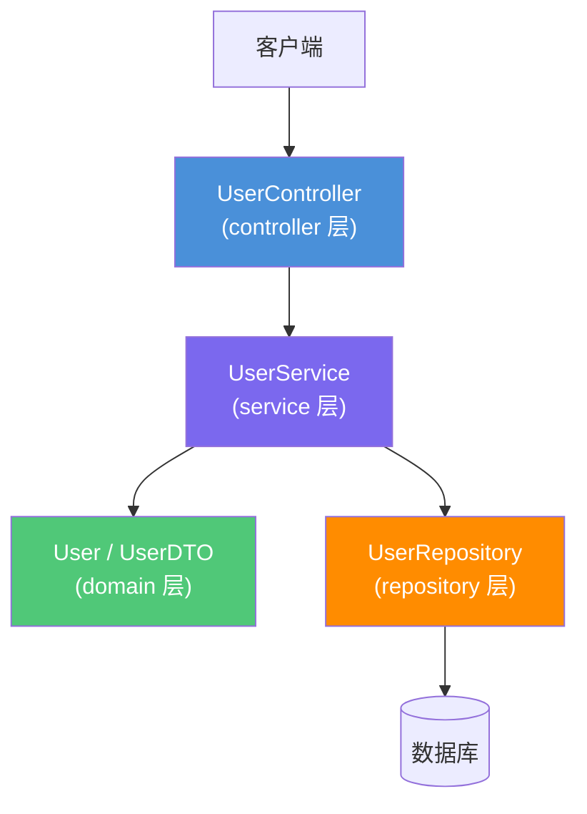

# [功能名称] 技术设计文档

> **使用说明**：将 `[功能名称]` 替换为实际功能名称，按照各章节提示填写内容，删除所有 `>` 引用块（使用说明）后保存。
>
> **关联需求**：[需求文档链接，例如：../01-product-specs/user-management-spec.md]  
> **文档状态**：草稿 / 评审中 / 已确认  
> **创建时间**：YYYY-MM-DD  
> **最后更新**：YYYY-MM-DD  
> **负责人**：@username

---

## 概述

> 用 2-3 句话描述技术方案的核心思路，让读者快速了解整体方向。

[技术方案简述，例如：基于 Spring Boot + JPA 实现用户管理功能，采用标准四层架构，通过 JWT 进行身份认证。]

---

## 架构设计

### 组件关系图

> 使用 Mermaid 绘制组件关系图，展示各层之间的依赖关系。必须体现四层架构约束。



### 数据流向

> 描述数据如何在各层之间流动，包括请求处理流程和响应返回流程。

**请求处理流程**：

1. 客户端发送 HTTP 请求到 `{Controller 类名}`
2. Controller 接收请求参数，调用参数校验（`@Valid`）
3. Controller 将请求 DTO 传递给 `{Service 类名}`
4. Service 执行业务逻辑，调用 `{Repository 类名}` 进行数据操作
5. Repository 与数据库交互，返回实体对象
6. Service 将实体对象转换为响应 DTO
7. Controller 将响应 DTO 包装为统一响应格式返回

**异常处理流程**：

1. Service 或 Repository 抛出业务异常（`{ExceptionClass}`）
2. 全局异常处理器（`GlobalExceptionHandler`）捕获异常
3. 返回标准错误响应格式

---

## 接口定义

### REST API

> 列出所有 REST API 端点，包含完整的请求/响应格式定义。

**基础路径**：`/api/v1/[module]`

| 方法 | 路径 | 描述 | 认证 | 请求体 | 响应体 |
|------|------|------|------|--------|--------|
| GET | `/api/v1/[module]/{id}` | 根据 ID 查询 | 需要 | — | `[ResourceDTO]` |
| GET | `/api/v1/[module]` | 分页查询列表 | 需要 | — | `Page<[ResourceDTO]>` |
| POST | `/api/v1/[module]` | 创建新资源 | 需要 | `[CreateRequest]` | `[ResourceDTO]` |
| PUT | `/api/v1/[module]/{id}` | 更新资源 | 需要 | `[UpdateRequest]` | `[ResourceDTO]` |
| DELETE | `/api/v1/[module]/{id}` | 删除资源 | 需要 | — | — |

#### 接口详情：GET /api/v1/[module]/{id}

**描述**：根据 ID 查询[资源名称]详情

**请求参数**：

| 参数名 | 位置 | 类型 | 必填 | 描述 |
|--------|------|------|------|------|
| id | path | Long | 是 | 资源唯一标识 |

**响应示例（200 OK）**：

```json
{
  "code": 200,
  "message": "success",
  "data": {
    "id": 1,
    "name": "示例名称",
    "createdAt": "2024-01-01T00:00:00Z",
    "updatedAt": "2024-01-01T00:00:00Z"
  }
}
```

**错误响应示例（404 Not Found）**：

```json
{
  "code": 404,
  "message": "资源不存在",
  "data": null
}
```

#### 接口详情：POST /api/v1/[module]

**描述**：创建新[资源名称]

**请求体**：

```json
{
  "name": "新资源名称",
  "description": "资源描述"
}
```

**请求体字段说明**：

| 字段名 | 类型 | 必填 | 校验规则 | 描述 |
|--------|------|------|----------|------|
| name | String | 是 | 长度 1-100 | 资源名称 |
| description | String | 否 | 长度 ≤ 500 | 资源描述 |

**响应示例（201 Created）**：

```json
{
  "code": 201,
  "message": "创建成功",
  "data": {
    "id": 2,
    "name": "新资源名称",
    "description": "资源描述",
    "createdAt": "2024-01-01T00:00:00Z"
  }
}
```

---

## 数据模型

### 实体类

> 定义 JPA 实体类的字段，包含数据库映射信息。

**`[EntityName]` 实体类**（对应表：`t_[table_name]`）：

| 字段名 | Java 类型 | 数据库类型 | 约束 | 说明 |
|--------|-----------|-----------|------|------|
| id | Long | BIGINT | PK, AUTO_INCREMENT | 主键 |
| name | String | VARCHAR(100) | NOT NULL | 名称 |
| description | String | VARCHAR(500) | NULL | 描述 |
| createdAt | LocalDateTime | DATETIME | NOT NULL | 创建时间 |
| updatedAt | LocalDateTime | DATETIME | NOT NULL | 更新时间 |
| deleted | Boolean | TINYINT(1) | NOT NULL, DEFAULT 0 | 逻辑删除标志 |

### DTO

> 定义数据传输对象，说明与实体类的映射关系。

**`[ResourceDTO]`（响应 DTO）**：

| 字段名 | Java 类型 | 来源字段 | 说明 |
|--------|-----------|---------|------|
| id | Long | entity.id | 资源 ID |
| name | String | entity.name | 名称 |
| description | String | entity.description | 描述 |
| createdAt | String | entity.createdAt（格式化） | 创建时间（ISO 8601） |

**`[CreateRequest]`（创建请求 DTO）**：

| 字段名 | Java 类型 | 校验注解 | 说明 |
|--------|-----------|---------|------|
| name | String | `@NotBlank @Size(max=100)` | 名称 |
| description | String | `@Size(max=500)` | 描述（可选） |

### 数据库表结构

```sql
CREATE TABLE `t_[table_name]` (
    `id`          BIGINT       NOT NULL AUTO_INCREMENT COMMENT '主键',
    `name`        VARCHAR(100) NOT NULL                COMMENT '名称',
    `description` VARCHAR(500)                         COMMENT '描述',
    `created_at`  DATETIME     NOT NULL DEFAULT CURRENT_TIMESTAMP COMMENT '创建时间',
    `updated_at`  DATETIME     NOT NULL DEFAULT CURRENT_TIMESTAMP ON UPDATE CURRENT_TIMESTAMP COMMENT '更新时间',
    `deleted`     TINYINT(1)   NOT NULL DEFAULT 0      COMMENT '逻辑删除：0-正常，1-已删除',
    PRIMARY KEY (`id`),
    INDEX `idx_name` (`name`)
) ENGINE=InnoDB DEFAULT CHARSET=utf8mb4 COMMENT='[表说明]';
```

---

## 技术选型

> 说明本功能涉及的框架、库、工具的选择理由。

| 技术 | 版本 | 用途 | 选择理由 |
|------|------|------|----------|
| Spring Boot | 3.x | 应用框架 | 项目统一技术栈 |
| Spring Data JPA | 3.x | 数据访问层 | 简化 CRUD 操作，支持分页查询 |
| MapStruct | 1.5.x | DTO 映射 | 编译期生成映射代码，性能优于反射 |
| Lombok | 1.18.x | 代码简化 | 减少样板代码（getter/setter/builder） |
| [其他技术] | [版本] | [用途] | [选择理由] |

---

## 风险与注意事项

> 列出潜在的技术风险和需要特别注意的实现细节。

### 技术风险

| 风险 | 影响程度 | 概率 | 应对策略 |
|------|----------|------|----------|
| [风险描述] | 高/中/低 | 高/中/低 | [应对措施] |

### 注意事项

1. **[注意事项 1]**：[详细说明]
2. **[注意事项 2]**：[详细说明]
3. **并发安全**：[如果涉及并发操作，说明如何保证数据一致性]
4. **事务边界**：[说明事务的范围和传播行为]

---

## 测试策略

> 说明本功能的测试方案，与 `harness-collab/03-exec-plans/` 中的执行计划对应。

| 测试类型 | 测试类 | 测试框架 | 覆盖场景 |
|----------|--------|----------|----------|
| Service 单元测试 | `[ServiceName]Test` | Mockito | 正常流程、异常场景 |
| Controller 切片测试 | `[ControllerName]Test` | @WebMvcTest | API 参数校验、响应格式 |
| Repository 切片测试 | `[RepositoryName]Test` | @DataJpaTest | 查询方法、分页 |

---

## 变更记录

| 版本 | 日期 | 变更内容 | 变更人 |
|------|------|----------|--------|
| v1.0 | YYYY-MM-DD | 初始版本 | @username |
